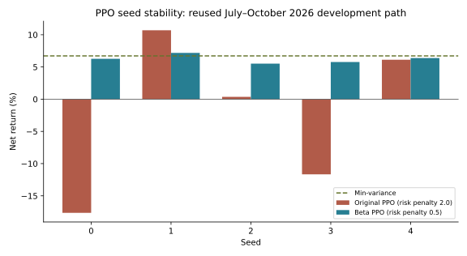
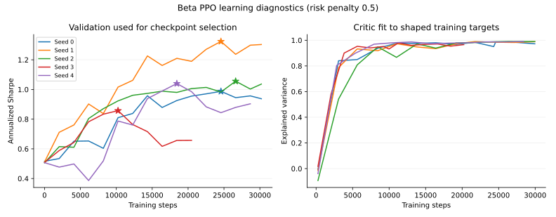

# Beta PPO stability experiment, 2026-10-08

PPO now trains consistently and produces much more stable portfolios across seeds. Min-variance
still has higher Sharpe and lower drawdown on the reused July–October path. This establishes an
operational learning baseline, not an investment edge.

Original run: `run_01M4EK4M4G688MFX5H7SJZGSXJ`. Revised run:
`run_01M4EQ42710HDSHK2WQTS1XMZX`. Implementation branch: `codex/ppo-stability-beta`.
Repeat run: `run_01M4ERRE6F29S2N9DGHJBTYJE8`. It used the identical protocol and introduced no parameter search.

## Changes

- Make portfolio drawdown observable because the reward depends on its high water mark.
- Replace 106 raw-return/weight inputs with 37 inputs: return means and volatility at 5/20/60
  sessions, current instrument/cash weights, and drawdown, using point-in-time observations.
- Randomize 64-session training episodes and bootstrap at artificial episode boundaries.
- Use softmax scale 1, move 25% toward proposed allocations, and penalize traded NAV at 0.001
  alongside actual costs. The softmax proposal itself cannot allocate more than about 60% to
  any one asset or cash. These choices deliberately constrain concentration and allocation changes.
- Select reward settings by average validation Sharpe across every requested seed. Evaluate the
  ensemble of their target portfolios and every seed individually; exclude incomplete seed grids.
- Record optimizer diagnostics, step-zero comparisons, validation curves and all seed results.
- Prevent a reused test period from passing promotion. Deploy beta only.

This is a bundle comparison; it does not identify which change caused improvement. The longer
warmup also changes training-period exposure: the first 60 sessions are cash, versus 20 previously.
Reduced training returns alone do not establish that memorization disappeared.

## Results

Same 69-session development period, net of common-evaluator costs, with daily decisions and
next-open execution. Sharpe is annualized; turnover is traded notional divided by initial capital.

| Strategy | Return | Sharpe | Max drawdown | Turnover |
|---|---:|---:|---:|---:|
| Original selected PPO seed | 10.7% | 2.16 | 5.8% | 74× |
| Revised PPO ensemble | 6.29% | 1.58 | 5.48% | 2.87× |
| Min-variance | 6.72% | 1.90 | 4.06% | 3.36× |
| Equal weight | 6.45% | 1.61 | 5.26% | 1.81× |
| Buy and hold | 5.94% | 1.50 | 5.23% | 1.00× |

| Seed statistic, selected reward configuration | Original PPO | Revised PPO |
|---|---:|---:|
| Average net return | −2.42% | 6.23% |
| Return standard deviation | 11.94 percentage points | 0.64 percentage points |
| Return range | −17.6% to +10.7% | +5.52% to +7.18% |
| Average turnover | 72.64× | 3.41× |

All ten learners selected trained checkpoints over step zero. Near those checkpoints, explained
variance was 0.93–0.99, approximate KL 0.009–0.018, and clip fraction 0.06–0.19. Episode rewards
improved. These concern shaped training targets and validation selection, not forecasting future
market returns. Ensemble returns were 77.2% on train, 9.0% on validation, and 6.3% on development.
The reward configuration selected on validation has risk penalty 0.5.

Training still contains just 250 sessions, with a universe chosen with hindsight. Five seeds share
one market path. Their improved stability does not establish robustness across market regimes.

## Reporting and verification

Optimizer histories pushed the revised run above the response-compaction threshold. The old
code discarded validation curves and omitted the full summary from its evidence artifact. The
fix persists the full summary before compaction, keeps every validation curve in the API, samples
only optimizer histories, and identifies the complete diagnostic artifact.

A regression test reproduces the oversized response and verifies preservation. Other tests cover
state/accounting parity with the common evaluator, seeded episodes and TD bootstrapping,
ensemble results, incomplete seed grids and contract-valid container outputs. Local build gates
and the first cloud build, CloudFormation deployment and beta integration tests passed.

Both cloud builds, beta CloudFormation deployments and integration suites passed. Both pipeline
executions were stopped before Gamma, and their original transitions restored. Gamma/prod were
not deployed. The repeat matched every family's metrics on all three splits, PPO seed statistics
and selected settings exactly. It preserved all ten validation curves (148 checkpoint rows) in a
104,334-byte API response, with the full diagnostic artifact identified. This verifies repeatability
and reporting; the repeated market path supplies no additional independent financial evidence.

Initial validation Sharpe was approximately 0.51 for every seed; selected checkpoints ranged from
0.86 to 1.32 in the chosen reward configuration. Stars identify the selected checkpoints. Critic
history is sampled for response size; its explained variance concerns shaped TD targets.

## Costs

The project ceiling remains USD 50. Initial work reserves at most USD 2, with at most three
sequential CPU jobs estimated below USD 0.25 each and capped at 3000 seconds. Two runs were
completed, with identical model settings. There is no scheduled search, GPU or persistent endpoint.

The first run reports 500 SageMaker billable seconds at the live USD 0.23/hour price: USD 0.032
compute. Its three small CodeBuild jobs total 11 rounded minutes, USD 0.055 gross before any free
tier, using [AWS pricing and rounding](https://aws.amazon.com/codebuild/pricing/). These are usage
estimates, not invoice charges; tax and ancillary API, storage, logging, pipeline and existing
infrastructure costs are additional. The repeat reports 499 billable seconds. Together, training
used 999 billable seconds (USD 0.063825); six CodeBuild jobs used 21 rounded minutes (USD 0.105
gross). Total training/build compute estimate: **USD 0.168825**, about USD 0.17 before ancillary
charges and tax. This is within the USD 2 new-work reserve; final invoice charges remain delayed.

AWS reports about USD 39.77 month-to-date for the broader account. The tagged project budget
reports zero while tagging/billing are incomplete; that does not establish USD 50 remaining.
Submission checked the application ledger and allowed USD 5 for delayed billing in its
conservative headroom check against the broader account's reported charges.

## Next research

Use more training regimes, rolling chronological evaluation, point-in-time universe membership,
and fresh forward paper observations. Compare against traditional controls and an untrained
policy under the same action transform. Cross-asset risk features and feature/action ablations
are sensible next hypotheses. Tuning the known path until PPO wins cannot establish an edge.
